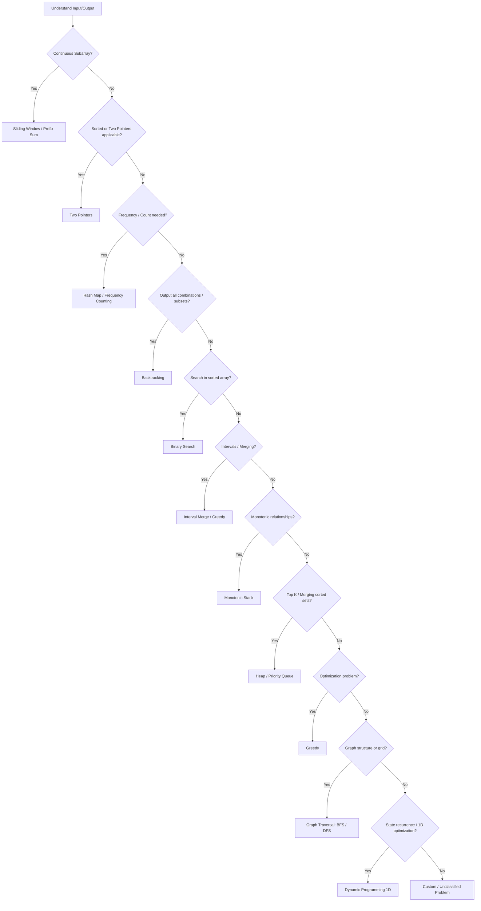

# Algorithm Patterns & Interview Checklist Cheat Sheet

## **Pattern Mapping Checklist**

| Pattern                              | Input / Output Characteristics                | Canonical Skeleton / Approach                   | Key Tricks / Notes                                                          |
| ------------------------------------ | --------------------------------------------- | ----------------------------------------------- | --------------------------------------------------------------------------- |
| **1. Sliding Window**                | Continuous subarray, max/min/unique counts    | Two pointers, expand/contract window            | Track frequency/counts, left/right pointers, window size                    |
| **2. Two Pointers**                  | Sorted array, pairs, or triplets              | Left/right pointers moving toward each other    | Skip duplicates, adjust pointers based on sum/condition                     |
| **3. Fast & Slow Pointers**          | Linked list cycle, middle, palindrome         | Two pointers at different speeds (1x, 2x)       | Floyd's algorithm, O(1) space, fast catches slow in cycle                   |
| **4. Hash Map / Frequency Counting** | Counting occurrences, anagrams, subarray sums | Map of counts or prefix sums                    | Use difference for prefix sums, sorting for key derivation                  |
| **5. Backtracking**                  | Output: all combinations/permutations/subsets | Recursive DFS on search space tree              | Track state, startIndex, constraints, pruning, backtrack                    |
| **6. Binary Search**                 | Sorted array, monotonic property              | Divide-and-conquer (left, right, mid)           | Template: while left ≤ right, decide side, return index or bound            |
| **7. Interval / Merge**              | Intervals, scheduling, merging                | Sort intervals, iterate, merge using conditions | curEnd vs nextStart, merge eligibility vs merge execution                   |
| **8. Monotonic Stack**               | Next greater/smaller element, histogram       | Stack maintaining monotonic property            | Push/pop based on comparison, stack top represents last seen relevant value |
| **9. Top K Elements**                | K largest/smallest, Kth element, top K freq   | Min/max heap of size K                          | Min-heap for K largest, max-heap for K smallest, maintain heap size = K     |
| **10. Heap / Priority Queue**        | Median, merge K lists, scheduling             | Min/max heap, two-heap technique                | Two heaps for median, priority extraction for merging                       |
| **11. Greedy**                       | Optimization, local choice → global solution  | Sort input (or use heap), iterate               | Check greedy choice correctness, prove or justify locally optimal decisions |
| **12. Graph Traversal**              | Nodes/edges, grid/tree                        | BFS (queue), DFS (stack/recursion)              | Decide BFS vs DFS based on shortest path vs full traversal, mark visited    |
| **13. Dynamic Programming (1D)**     | Optimization over 1D state (max/min/count)    | State array → transition → base                 | Trace state table, relate current state to previous states                  |

---

## **Canonical Skeletons by Pattern**

### 1. Sliding Window
```csharp
int left = 0;
int maxLen = 0;

for (int right = 0; right < arr.Length; right++) {
    // include arr[right]
    while (window invalid) {
        // shrink window from left
        left++;
    }
    // update result
    maxLen = Math.Max(maxLen, right - left + 1);
}
return maxLen;
```
### 2. Two Pointers
```csharp
int left = 0, right = arr.Length - 1;
while (left < right) {
    int sum = arr[left] + arr[right];
    if (sum == target) return true;
    else if (sum < target) left++;
    else right--;
}
return false;
```
### 3. Fast & Slow Pointers
```csharp
bool HasCycle(ListNode head) {
    ListNode slow = head, fast = head;
    while (fast != null && fast.next != null) {
        slow = slow.next;           // Move 1 step
        fast = fast.next.next;      // Move 2 steps
        if (slow == fast) return true;
    }
    return false;
}
```
### 3. Fast & Slow Pointers
```csharp
bool HasCycle(ListNode head) {
    ListNode slow = head, fast = head;
    while (fast != null && fast.next != null) {
        slow = slow.next;           // Move 1 step
        fast = fast.next.next;      // Move 2 steps
        if (slow == fast) return true;
    }
    return false;
}
```
### 4. Prefix Sum / Subarray
```csharp
var sumFreq = new Dictionary<int,int>() { {0,1} };
int prefixSum = 0, count = 0;

for(int i=0; i<arr.Length; i++){
    prefixSum += arr[i];
    int diff = prefixSum - target;
    if(sumFreq.ContainsKey(diff)) count += sumFreq[diff];
    sumFreq[prefixSum] = sumFreq.GetValueOrDefault(prefixSum) + 1;
}
return count;
```
### 5. Hash Map / Frequency Counting
```csharp
var freq = new Dictionary<char,int>();
foreach(char c in str1) freq[c] = freq.GetValueOrDefault(c)+1;
foreach(char c in str2){
    if(!freq.ContainsKey(c) || freq[c]==0) return false;
    freq[c]--;
}
return true;
```
### 6. Backtracking / DFS
```csharp
void Backtrack(List<int> curr, int start){
    result.Add(new List<int>(curr)); // record state
    for(int i=start; i<n; i++){
        curr.Add(nums[i]);
        Backtrack(curr, i+1); // move forward
        curr.RemoveAt(curr.Count-1); // undo
    }
}
```
### 7. Binary Search
```csharp
int left=0, right=arr.Length-1;
while(left <= right){
    int mid = left + (right-left)/2;
    if(arr[mid]==target) return mid;
    else if(arr[mid]<target) left=mid+1;
    else right=mid-1;
}
return -1;
```
### 8. Top K Elements
```csharp
int FindKthLargest(int[] nums, int k) {
    var minHeap = new PriorityQueue<int, int>();
    foreach (int num in nums) {
        minHeap.Enqueue(num, num);
        if (minHeap.Count > k) minHeap.Dequeue();
    }
    return minHeap.Peek(); // Kth largest
}
```
### 9. Heap / Priority Queue
```csharp
var pq = new PriorityQueue<int>();
foreach(var val in arr) pq.Enqueue(val);
while(pq.Count > 0){
    var top = pq.Dequeue();
    // process top
}
```
### 10. Dynamic Programming
```csharp
int[] dp = new int[n];
dp[0] = base_case;
for(int i=1; i<n; i++){
    dp[i] = f(dp[i-1], arr[i]); // recurrence relation
}
return dp[n-1];
```
## Pattern Decision Flow (Mermaid Diagram)


##Canonical Skeletons for 13 Patterns and Variants
| Pattern                              | Variants / Common Problems                                             | Canonical Skeleton / Template                                                                                                                                                                                                            | Key Notes / Comments                                                                                        |
| ------------------------------------ | ---------------------------------------------------------------------- | ---------------------------------------------------------------------------------------------------------------------------------------------------------------------------------------------------------------------------------------- | ----------------------------------------------------------------------------------------------------------- |
| **1. Sliding Window**                | Max/Min subarray, Longest substring with unique chars, Sum of subarray | `csharp var left=0,maxLen=0; var map=new Dictionary<char,int>(); for(var right=0; right<s.Length; right++){ map[s[right]]++; while(condition) map[s[left]]--; left++; }`                                                                 | Expand window, contract with condition; track frequency/count; update result inside loop                    |
| **2. Two Pointers**                  | Sorted array pair sum, 3Sum, Container with most water                 | `csharp int left=0,right=nums.Length-1; while(left<right){ if(condition) left++; else right--; }`                                                                                                                                        | Always move pointers based on problem condition; skip duplicates if needed                                  |
| **3. Fast & Slow Pointers**          | Cycle detection, middle of list, happy number                          | `csharp ListNode slow=head,fast=head; while(fast!=null && fast.next!=null){ slow=slow.next; fast=fast.next.next; if(slow==fast) return true; } return false;`                                                                            | Floyd's algorithm: fast moves 2x speed, catches slow in cycle; O(1) space                                   |
| **4. Hash Map / Frequency Counting** | Anagram check, subarray sum equals k, grouping                         | `csharp var map=new Dictionary<type,int>(); foreach(var x in input) map[x]++; foreach(var y in input2){ if(!map.ContainsKey(y)) return false; map[y]--; }`                                                                               | Prefix sum variant: track sum counts and diff for subarrays                                                 |
| **5. Backtracking**                  | Subsets, Combinations, Permutations, Combination sum                   | `csharp void Backtrack(int start){ if(base case){result.Add(...); return;} for(int i=start;i<n;i++){ current.Add(nums[i]); Backtrack(i+1); current.RemoveAt(...); } }`                                                                   | Track current state, prune with startIndex or constraints, backtrack after recursion                        |
| **6. Binary Search**                 | Classic search, lower_bound, upper_bound, rotated array search         | `csharp int left=0,right=n-1; while(left<=right){ int mid=(left+right)/2; if(nums[mid]==target) return mid; else if(nums[mid]<target) left=mid+1; else right=mid-1; }`                                                                   | Template adjusts for exact search or boundary (lower/upper bound)                                           |
| **7. Interval / Merge**              | Merge intervals, meeting rooms, insert interval                        | `csharp Array.Sort(intervals,(a,b)=>a.start-b.start); foreach(var iv in intervals){ if(curEnd>=iv.start){curEnd=Math.Max(curEnd,iv.end);} else { add previous; curEnd=iv.end;} }`                                                        | Sort first; check overlap to merge or start new interval                                                    |
| **8. Monotonic Stack**               | Next greater element, daily temperatures, largest rectangle            | `csharp Stack<int> st=new Stack<int>(); for(int i=0;i<n;i++){ while(st.Count>0 && nums[st.Peek()]<nums[i]){ res[st.Pop()]=nums[i]; } st.Push(i); }`                                                                                      | Maintain stack in increasing/decreasing order; pop when violation occurs                                    |
| **9. Top K Elements**                | Kth largest, K largest elements, Top K frequent                        | `csharp var minHeap=new PriorityQueue<int,int>(); foreach(var x in nums){ minHeap.Enqueue(x,x); if(minHeap.Count>k) minHeap.Dequeue(); } return minHeap.Peek();`                                                                          | Min-heap for K largest, max-heap for K smallest; maintain heap size = K                                     |
| **10. Heap / Priority Queue**        | Median from stream, merge K sorted lists, task scheduler               | `csharp var pq=new PriorityQueue<int,int>(); foreach(var x in heads){ pq.Enqueue(x,x.val); } while(pq.Count>0){ var node=pq.Dequeue(); if(node.next!=null) pq.Enqueue(node.next,node.next.val); }`                                       | Two heaps for median (max+min); priority extraction for merging K lists                                     |
| **11. Greedy**                       | Activity selection, jump game, coin change                             | `csharp Array.Sort(intervals,(a,b)=>a.end-b.end); int lastEnd=-1; foreach(var iv in intervals){ if(iv.start>lastEnd){count++; lastEnd=iv.end;} }`                                                                                        | Sort or select based on local optimal; confirm greedy works globally                                        |
| **12. Graph Traversal**              | BFS grid, DFS tree, shortest path                                      | `csharp void BFS(Node start){ Queue<Node> q=new Queue<Node>(); q.Enqueue(start); visited[start]=true; while(q.Count>0){ var n=q.Dequeue(); foreach(var nbr in n.neighbors){ if(!visited[nbr]){ visited[nbr]=true; q.Enqueue(nbr); }}} }` | BFS for shortest paths, DFS for full exploration or backtracking                                            |
| **13. Dynamic Programming (1D)**     | Climbing stairs, house robber, max subarray                            | `csharp int[] dp=new int[n]; dp[0]=base; for(int i=1;i<n;i++){ dp[i]=f(dp[i-1], dp[i-2],...); }`                                                                                                                                         | Identify state, transition, base case; optional space optimization with rolling variables                   |
