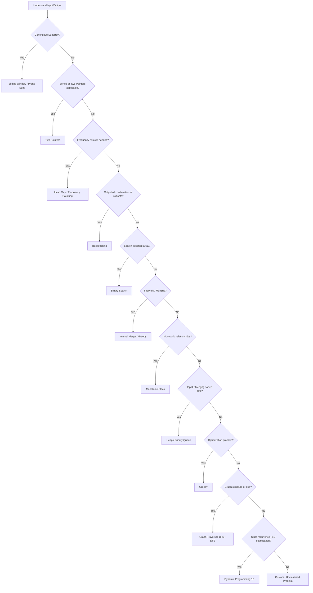

# Algorithm Patterns & Interview Checklist Cheat Sheet

## **Pattern Mapping Checklist**

| Pattern                              | Input / Output Characteristics                | Canonical Skeleton / Approach                   | Key Tricks / Notes                                                          |
| ------------------------------------ | --------------------------------------------- | ----------------------------------------------- | --------------------------------------------------------------------------- |
| **1. Sliding Window**                | Continuous subarray, max/min/unique counts    | Two pointers, expand/contract window            | Track frequency/counts, left/right pointers, window size                    |
| **2. Two Pointers**                  | Sorted array, pairs, or triplets              | Left/right pointers moving toward each other    | Skip duplicates, adjust pointers based on sum/condition                     |
| **3. Fast & Slow Pointers**          | Linked list cycle, middle, palindrome         | Two pointers at different speeds (1x, 2x)       | Floyd's algorithm, O(1) space, fast catches slow in cycle                   |
| **4. Hash Map / Frequency Counting** | Counting occurrences, anagrams, subarray sums | Map of counts or prefix sums                    | Use difference for prefix sums, sorting for key derivation                  |
| **5. Backtracking**                  | Output: all combinations/permutations/subsets | Recursive DFS on search space tree              | Track state, startIndex, constraints, pruning, backtrack                    |
| **6. Binary Search**                 | Sorted array, monotonic property              | Divide-and-conquer (left, right, mid)           | Template: while left ≤ right, decide side, return index or bound            |
| **7. Interval / Merge**              | Intervals, scheduling, merging                | Sort intervals, iterate, merge using conditions | curEnd vs nextStart, merge eligibility vs merge execution                   |
| **8. Monotonic Stack**               | Next greater/smaller element, histogram       | Stack maintaining monotonic property            | Push/pop based on comparison, stack top represents last seen relevant value |
| **9. Top K Elements**                | K largest/smallest, Kth element, top K freq   | Min/max heap of size K                          | Min-heap for K largest, max-heap for K smallest, maintain heap size = K     |
| **10. Heap / Priority Queue**        | Median, merge K lists, scheduling             | Min/max heap, two-heap technique                | Two heaps for median, priority extraction for merging                       |
| **11. Greedy**                       | Optimization, local choice → global solution  | Sort input (or use heap), iterate               | Check greedy choice correctness, prove or justify locally optimal decisions |
| **12. Graph Traversal**              | Nodes/edges, grid/tree                        | BFS (queue), DFS (stack/recursion)              | Decide BFS vs DFS based on shortest path vs full traversal, mark visited    |
| **13. Dynamic Programming (1D)**     | Optimization over 1D state (max/min/count)    | State array → transition → base                 | Trace state table, relate current state to previous states                  |
| **14. Dynamic Programming (2D)**     | Grid paths, LCS, edit distance                | 2D table, transition from neighbors/prev states | Build table row-by-row or column-by-column, often space optimizable to 1D   |
| **15. Binary Tree**                  | Tree structure, root-to-leaf paths            | DFS (recursive), BFS (queue)                    | Recursive post-order for properties, BFS for level-order, validate with ranges |

---

## **Canonical Skeletons by Pattern**

### 1. Sliding Window
Define 'window state' and 'invalid condition'
```csharp
int left = 0;
// Initialize: window state, result

for (int right = 0; right < n; right++) {
    // Expand: add right element to window
    
    while (/* window invalid */) {
        // Shrink: remove left element from window
        left++;
    }
    
    // Update: result from [left, right] window
}
```

### 2. Two Pointers
Define pointer movement based on condition
```csharp
int left = 0, right = n - 1;

while (left < right) {
    // Evaluate: current state from left & right
    
    if (/* target condition */) {
        // Process: record or return
    }
    
    // Move: adjust pointers by condition
    if (/* condition */) left++;
    else right--;
}
```

### 3. Fast & Slow Pointers
Fast moves 2x speed, slow moves 1x
```csharp
Node slow = start, fast = start;

while (fast != null && fast.next != null) {
    slow = slow.next;        // 1x speed
    fast = fast.next.next;   // 2x speed
    
    if (slow == fast) {
        // Meet point: cycle or target found
    }
}
```

### 4. Hash Map / Frequency Counting
Track occurrences or mappings
```csharp
var map = new Dictionary<TKey, TValue>();

foreach (var item in collection) {
    // Build: map[key] = map.GetValueOrDefault(key) + 1
}

foreach (var kvp in map) {
    // Process: use kvp.Key, kvp.Value
}
```

### 5. Prefix Sum
Track cumulative values with map
```csharp
var map = new Dictionary<int, int> { {0, 1} };
int prefix = 0, result = 0;

for (int i = 0; i < n; i++) {
    prefix += arr[i];
    
    // Query: check if (prefix - target) exists
    if (map.ContainsKey(prefix - target)) {
        result += map[prefix - target];
    }
    
    // Store: current prefix
    map[prefix] = map.GetValueOrDefault(prefix) + 1;
}
```

### 6. Monotonic Stack
Maintain monotonic order (increasing/decreasing)
```csharp
var stack = new Stack<int>();

for (int i = 0; i < n; i++) {
    while (stack.Count > 0 && /* violates monotonic property */) {
        var popped = stack.Pop();
        // Process: popped element found its boundary
    }
    
    stack.Push(i);
}
```

### 7. Binary Search
Template for sorted search space
```csharp
int left = 0, right = n - 1;

while (left <= right) {
    int mid = left + (right - left) / 2;
    
    if (/* found target */) return mid;
    else if (/* search right */) left = mid + 1;
    else right = mid - 1;
}
```

### 8. Top K Elements
Min-heap for K largest, max-heap for K smallest
```csharp
var heap = new PriorityQueue<T, int>();

foreach (var item in collection) {
    heap.Enqueue(item, priority);
    
    if (heap.Count > k) {
        heap.Dequeue();
    }
}
// Heap contains top K elements
```

### 9. Intervals / Merge
Sort by start, merge overlapping
```csharp
Array.Sort(intervals, (a, b) => a.start.CompareTo(b.start));
var result = new List<Interval>();

foreach (var curr in intervals) {
    if (result.Count == 0 || result.Last().end < curr.start) {
        result.Add(curr);
    } else {
        // Merge: extend end boundary
        result.Last().end = Math.Max(result.Last().end, curr.end);
    }
}
```

### 10. Heap / Priority Queue
Process elements by priority
```csharp
var heap = new PriorityQueue<T, int>();

foreach (var item in collection) {
    heap.Enqueue(item, priority);
}

while (heap.Count > 0) {
    var item = heap.Dequeue();
    // Process: highest/lowest priority first
}
```

### 11. Greedy
Sort by criterion, choose locally optimal
```csharp
Array.Sort(items, (a, b) => /* compare by greedy property */);

foreach (var item in items) {
    if (/* greedy condition */) {
        // Choose: take item, update state
    }
}
```

### 12. Graph Traversal (DFS)
Recursive depth-first exploration
```csharp
var visited = new HashSet<T>();

void DFS(Node node) {
    if (visited.Contains(node)) return;
    
    visited.Add(node);
    // Process: current node
    
    foreach (var neighbor in node.Neighbors) {
        DFS(neighbor);
    }
}
```

### 13. Graph Traversal (BFS)
Queue-based level-order exploration
```csharp
var queue = new Queue<T>();
var visited = new HashSet<T>();

queue.Enqueue(start);
visited.Add(start);

while (queue.Count > 0) {
    var node = queue.Dequeue();
    // Process: current node
    
    foreach (var neighbor in node.Neighbors) {
        if (!visited.Contains(neighbor)) {
            visited.Add(neighbor);
            queue.Enqueue(neighbor);
        }
    }
}
```

### 14. Backtracking
Explore all paths with undo
```csharp
void Backtrack(State current, int index) {
    if (/* base case */) {
        result.Add(Copy(current));
        return;
    }
    
    for (int i = index; i < n; i++) {
        // Choose: add to current state
        // Explore: recurse with next index
        Backtrack(current, i + 1);
        // Undo: remove from current state
    }
}
```

### 15. Binary Tree (DFS - Recursive)
Recursive tree traversal and property checking
```csharp
int DFS(TreeNode root) {
    if (root == null) return baseCase;
    
    // Process: current node
    int left = DFS(root.left);
    int right = DFS(root.right);
    
    // Combine: left + right + current
    return CombineResults(left, right, root.val);
}
```

### 16. Binary Tree (BFS - Level Order)
Level-by-level traversal using queue
```csharp
var queue = new Queue<TreeNode>();
queue.Enqueue(root);

while (queue.Count > 0) {
    int levelSize = queue.Count;
    for (int i = 0; i < levelSize; i++) {
        var node = queue.Dequeue();
        // Process: current node
        
        if (node.left != null) queue.Enqueue(node.left);
        if (node.right != null) queue.Enqueue(node.right);
    }
}
```

## Pattern Decision Flow (Mermaid Diagram)


## Canonical Skeletons for 13 Patterns and Variants
| Pattern                              | Variants / Common Problems                                             | Canonical Skeleton / Template                                                                                                                                                                                                            | Key Notes / Comments                                                                                        |
| ------------------------------------ | ---------------------------------------------------------------------- | ---------------------------------------------------------------------------------------------------------------------------------------------------------------------------------------------------------------------------------------- | ----------------------------------------------------------------------------------------------------------- |
| **1. Sliding Window**                | Max/Min subarray, Longest substring with unique chars, Sum of subarray | `csharp var left=0,maxLen=0; var map=new Dictionary<char,int>(); for(var right=0; right<s.Length; right++){ map[s[right]]++; while(condition) map[s[left]]--; left++; }`                                                                 | Expand window, contract with condition; track frequency/count; update result inside loop                    |
| **2. Two Pointers**                  | Sorted array pair sum, 3Sum, Container with most water                 | `csharp int left=0,right=nums.Length-1; while(left<right){ if(condition) left++; else right--; }`                                                                                                                                        | Always move pointers based on problem condition; skip duplicates if needed                                  |
| **3. Fast & Slow Pointers**          | Cycle detection, middle of list, happy number                          | `csharp ListNode slow=head,fast=head; while(fast!=null && fast.next!=null){ slow=slow.next; fast=fast.next.next; if(slow==fast) return true; } return false;`                                                                            | Floyd's algorithm: fast moves 2x speed, catches slow in cycle; O(1) space                                   |
| **4. Hash Map / Frequency Counting** | Anagram check, subarray sum equals k, grouping                         | `csharp var map=new Dictionary<type,int>(); foreach(var x in input) map[x]++; foreach(var y in input2){ if(!map.ContainsKey(y)) return false; map[y]--; }`                                                                               | Prefix sum variant: track sum counts and diff for subarrays                                                 |
| **5. Backtracking**                  | Subsets, Combinations, Permutations, Combination sum                   | `csharp void Backtrack(int start){ if(base case){result.Add(...); return;} for(int i=start;i<n;i++){ current.Add(nums[i]); Backtrack(i+1); current.RemoveAt(...); } }`                                                                   | Track current state, prune with startIndex or constraints, backtrack after recursion                        |
| **6. Binary Search**                 | Classic search, lower_bound, upper_bound, rotated array search         | `csharp int left=0,right=n-1; while(left<=right){ int mid=(left+right)/2; if(nums[mid]==target) return mid; else if(nums[mid]<target) left=mid+1; else right=mid-1; }`                                                                   | Template adjusts for exact search or boundary (lower/upper bound)                                           |
| **7. Interval / Merge**              | Merge intervals, meeting rooms, insert interval                        | `csharp Array.Sort(intervals,(a,b)=>a.start-b.start); foreach(var iv in intervals){ if(curEnd>=iv.start){curEnd=Math.Max(curEnd,iv.end);} else { add previous; curEnd=iv.end;} }`                                                        | Sort first; check overlap to merge or start new interval                                                    |
| **8. Monotonic Stack**               | Next greater element, daily temperatures, largest rectangle            | `csharp Stack<int> st=new Stack<int>(); for(int i=0;i<n;i++){ while(st.Count>0 && nums[st.Peek()]<nums[i]){ res[st.Pop()]=nums[i]; } st.Push(i); }`                                                                                      | Maintain stack in increasing/decreasing order; pop when violation occurs                                    |
| **9. Top K Elements**                | Kth largest, K largest elements, Top K frequent                        | `csharp var minHeap=new PriorityQueue<int,int>(); foreach(var x in nums){ minHeap.Enqueue(x,x); if(minHeap.Count>k) minHeap.Dequeue(); } return minHeap.Peek();`                                                                          | Min-heap for K largest, max-heap for K smallest; maintain heap size = K                                     |
| **10. Heap / Priority Queue**        | Median from stream, merge K sorted lists, task scheduler               | `csharp var pq=new PriorityQueue<int,int>(); foreach(var x in heads){ pq.Enqueue(x,x.val); } while(pq.Count>0){ var node=pq.Dequeue(); if(node.next!=null) pq.Enqueue(node.next,node.next.val); }`                                       | Two heaps for median (max+min); priority extraction for merging K lists                                     |
| **11. Greedy**                       | Activity selection, jump game, coin change                             | `csharp Array.Sort(intervals,(a,b)=>a.end-b.end); int lastEnd=-1; foreach(var iv in intervals){ if(iv.start>lastEnd){count++; lastEnd=iv.end;} }`                                                                                        | Sort or select based on local optimal; confirm greedy works globally                                        |
| **12. Graph Traversal**              | BFS grid, DFS tree, shortest path                                      | `csharp void BFS(Node start){ Queue<Node> q=new Queue<Node>(); q.Enqueue(start); visited[start]=true; while(q.Count>0){ var n=q.Dequeue(); foreach(var nbr in n.neighbors){ if(!visited[nbr]){ visited[nbr]=true; q.Enqueue(nbr); }}} }` | BFS for shortest paths, DFS for full exploration or backtracking                                            |
| **13. Dynamic Programming (1D)**     | Climbing stairs, house robber, max subarray                            | `csharp int[] dp=new int[n]; dp[0]=base; for(int i=1;i<n;i++){ dp[i]=f(dp[i-1], dp[i-2],...); }`                                                                                                                                         | Identify state, transition, base case; optional space optimization with rolling variables                   |
| **14. Dynamic Programming (2D)**     | Unique paths, LCS, edit distance                                       | `csharp int[,] dp=new int[m,n]; dp[0,0]=base; for(int i=0;i<m;i++) for(int j=0;j<n;j++){ dp[i,j]=f(dp[i-1,j], dp[i,j-1],...); }`                                                                                                       | Build table row-by-row; often optimizable to 1D rolling array                                               |
| **15. Binary Tree**                  | Max depth, invert tree, validate BST, level order                      | `csharp int DFS(TreeNode root){ if(root==null) return base; int left=DFS(root.left); int right=DFS(root.right); return Combine(left,right,root.val); }`                                                                                   | Recursive DFS for properties; BFS with queue for level-order; track ranges for BST validation               |
